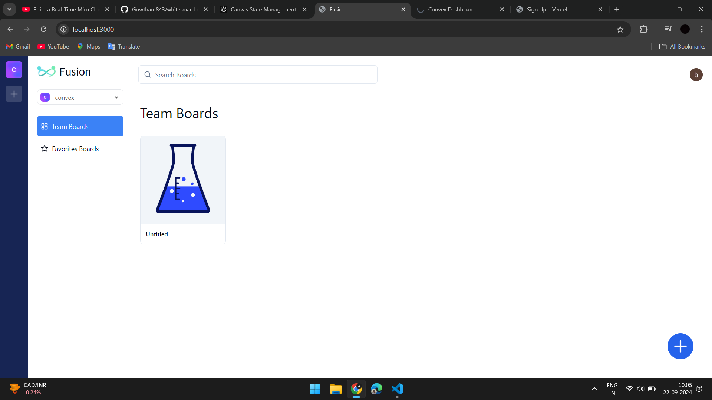
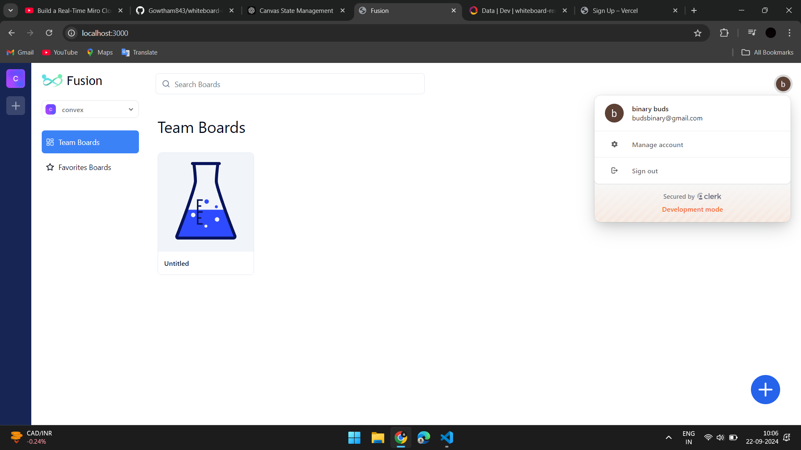
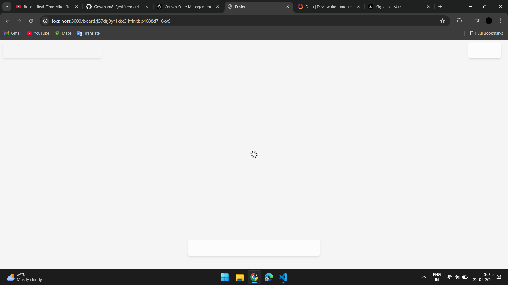
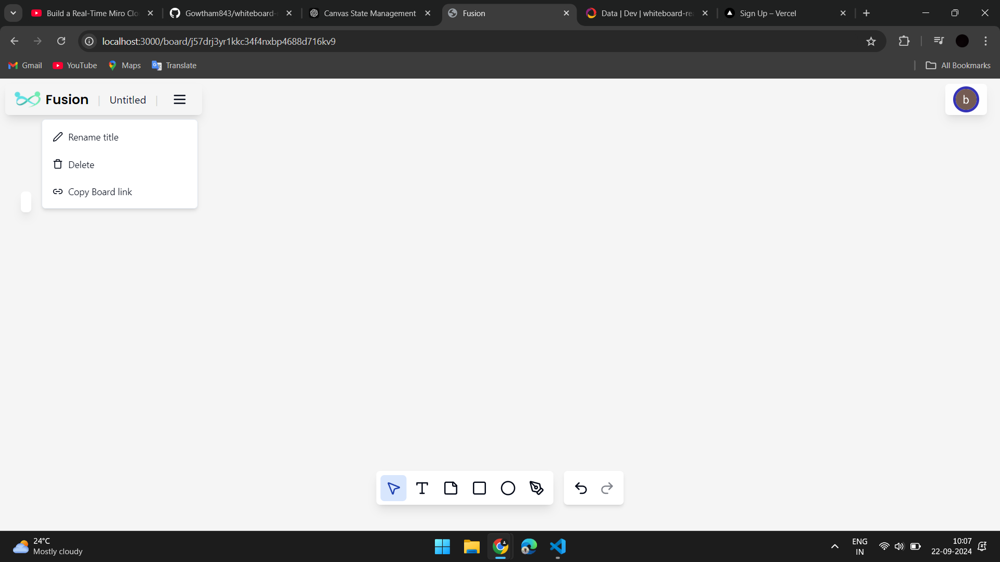
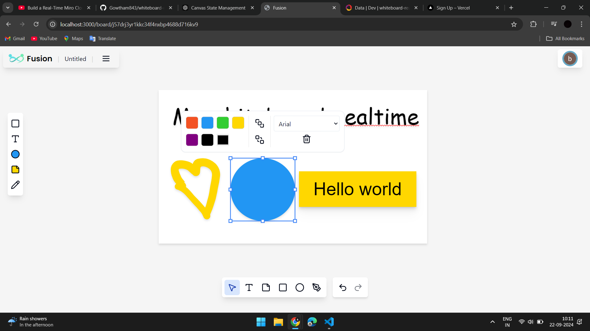

Here's a comprehensive README file structure with detailed explanations, focusing on UI/UX elements and the tools used in your project:

---

# Collaborative Canvas Application

Welcome to the Collaborative Canvas Application! This project allows multiple users to interact in real-time on a shared canvas, where they can draw, manipulate layers, and collaborate seamlessly. The application is built using modern web technologies with a focus on user experience and real-time collaboration.

## Table of Contents

- [Project Overview](#project-overview)
- [Features](#features)
- [Technology Stack](#technology-stack)
- [Installation](#installation)
- [Usage](#usage)
- [Tools & Libraries](#tools--libraries)
- [UI/UX Considerations](#uiux-considerations)
- [Future Enhancements](#future-enhancements)
- [Contributing](#contributing)
- [License](#license)

## Project Overview

This project is a collaborative canvas application where users can draw, edit, and interact with layers in real-time. It leverages cutting-edge technologies to provide a smooth and responsive user experience. The application supports various tools such as pencils, shapes, and text layers, enabling a rich collaborative environment.

## Features

- **Real-Time Collaboration**: Multiple users can interact on the canvas simultaneously with minimal latency.
- **Layer Management**: Users can create, update, and delete different types of layers such as rectangles, ellipses, paths, and text.
- **Font Customization**: Users can change font styles for text layers directly on the canvas.
- **Responsive Design**: The UI adapts to different screen sizes, ensuring a consistent experience across devices.
- **Session Management**: User sessions are managed securely with authentication.

## Technology Stack

- **React**: Front-end library for building user interfaces.
- **TypeScript**: Typed superset of JavaScript for type safety and better developer experience.
- **Liveblocks**: Handles real-time collaboration and state synchronization between users.
- **Clerk**: User authentication and session management.
- **Convex**: Backend-as-a-service for handling serverless functions and real-time data storage.
- **Tailwind CSS**: Utility-first CSS framework for styling.

## Installation

Follow these steps to set up the project locally:

1. **Clone the repository**:
   ```bash
   git clone https://github.com/yourusername/collaborative-canvas.git
   cd collaborative-canvas
   ```

2. **Install dependencies**:
   ```bash
   npm install
   ```

3. **Set up environment variables**:
   - Create a `.env.local` file and add your environment-specific variables.
   - Ensure you have API keys for Liveblocks, Clerk, and Convex.

4. **Run the development server**:
   ```bash
   npm run dev
   ```

5. **Open the app**:
   - Visit `http://localhost:3000` to view the application in your browser.

## Usage

1. **Sign up or Log in**: Users need to sign up or log in using Clerk's authentication system.
2. **Create a new canvas**: Users can start a new collaborative session or join an existing one.
3. **Use the toolbar**: The toolbar provides access to various drawing tools, layer management, and customization options.
4. **Collaborate**: Invite others to your canvas and start drawing together in real-time.

## Tools & Libraries

### Liveblocks

- **Purpose**: Facilitates real-time collaboration by synchronizing the state across users in different locations.
- **Why Used**: Ensures a smooth and real-time interactive experience, which is critical for collaborative applications.

### Clerk

- **Purpose**: Provides authentication and session management.
- **Why Used**: Simplifies user authentication, ensuring that only authorized users can access and interact with the canvas.

### Convex

- **Purpose**: Handles backend operations such as serverless functions and real-time data storage.
- **Why Used**: Provides a seamless backend experience without the need to manage servers, allowing the focus to remain on front-end development.

## UI/UX Considerations

- **Intuitive Interface**: The application uses a minimalistic design with clear icons and tooltips to guide users.
- **Responsive Layout**: Tailwind CSS ensures that the application is responsive, providing an optimal experience on both desktop and mobile devices.
- **Accessibility**: Efforts have been made to ensure that the application is accessible to all users, including those with disabilities.
- **Error Handling**: The app includes clear error messages and feedback mechanisms to improve user experience.

## Future Enhancements

- **Additional Tools**: Introducing more drawing tools and layer types.
- **Version Control**: Implementing a version control system for layers, allowing users to revert changes.
- **Offline Mode**: Adding offline capabilities for users to work without an internet connection.

## Screenshot of Projects













## Contributing

We welcome contributions! Please read our [contributing guidelines](CONTRIBUTING.md) for more information.

## License

This project is licensed under the MIT License. See the [LICENSE](LICENSE) file for details.


---


This README provides a clear and structured overview of your project, highlighting the tools and technologies you've used, along with a focus on UI/UX considerations. Adjust the sections as necessary to fit the specific details and requirements of your project.


## This project is Hosted in Vercel with login to github,
## This Project convex is connected to github,
## This project is used Clerk for login and it is connected to dequeuealternative gmail , i have changed clerk auth code as documentation code was not working
